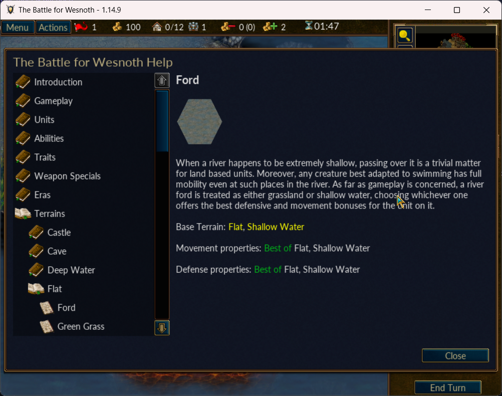
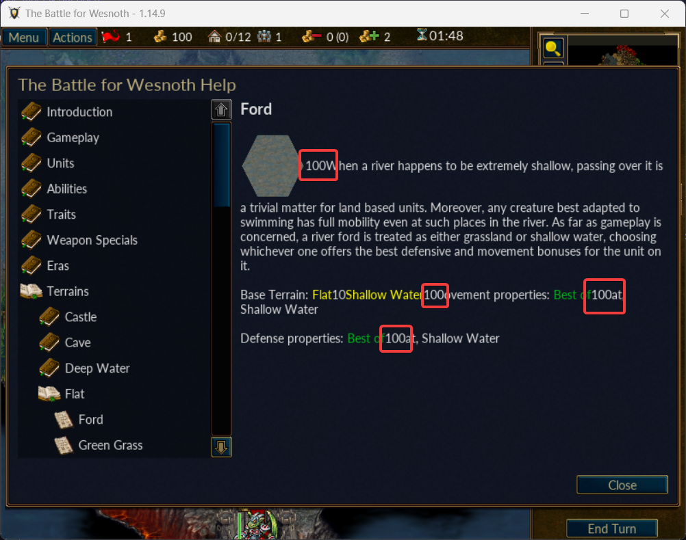

# Game Memory Manipulation with DLL Injection

**Author: KeesOG**

## 🎮 Overview
This project involves creating a stathack for the game Wesnoth 1.14.9, which displays the second player's gold value by injecting a DLL. We'll explore memory pointers, establish a code cave, and modify memory protections to intercept the game's string printing function and display custom values in the terrain description menu.

---

## Key Components

### 🔑 Memory Pointers
Memory pointers act as coordinates in the game's memory, helping us locate specific data. In this project, we use pointers like `player_base`, `game_base`, and `enemy_gold` to find the second player's gold value.

### 🕳 Code Cave
A code cave is a reserved space in the game's memory where we can insert our custom assembly instructions without disrupting normal game operations.

### 🔒 Memory Protection
We will temporarily modify memory protection settings to allow writing to normally protected memory areas, enabling us to insert and execute custom code.

---

## 📜 Detailed Process

### 🛠 DLL Injection

- **Initialization:** The DLL sets up the environment upon injection by modifying memory protection settings, allowing us to write custom instructions.

### 🔌 Hooking the Assembly Call

- **Inserting the Jump:** A jump instruction (`jmp`) is inserted at a critical point in the game’s code to redirect execution to our custom code cave. The `jmp` instruction changes the flow of execution to a new address, which is where we have our custom code.

### 🏴‍☠️ Retrieving Enemy Gold

- **Pointer Navigation:** We navigate through memory pointers to locate the second player's gold value, similar to following breadcrumbs. Pointers give us a way to dynamically locate the needed data, even if it moves around in memory.

### ✍️ Modifying the String

- **Conversion:** Convert the gold value into a string format.
- **Inserting the String:** The edited string is printed to the terrain description menu by manipulating the CPU's registers and memory addresses within the code cave, just before being run in assembly to print the strings.

### 🧩 Understanding the CPU and Registers

- **Pushad and Popad:** These instructions save (`pushad`) and restore (`popad`) all the general-purpose registers. This ensures that our modifications do not interfere with the normal operation of the game. For example, `pushad` saves all current register values onto the stack, and `popad` restores them.

- **Registers in Action:**
    - **EAX Register:** Commonly used for arithmetic operations and returning function values.
    - **EBX Register:** Typically used to point to data in memory.
    - **ECX and EDX Registers:** Often used for loop counters and temporary storage, respectively.

- **Using the CPU and Registers:** 
    - We move the converted gold value into the `eax` register, which will point to the memory location of our string.
    - The `bl` register can be used to hold each byte of the gold value as we construct the new string.

### 🔄 Restoring Original Functionality

- **Calling the Original Function:** After modifying the string, the original function is called to maintain normal game operation. This involves using a `call` instruction to transfer control to the function's address.
- **Returning to Normal:** Finally, we jump back to the original return address (`jmp`), allowing the game to continue as usual.

---

## 🖼 Screenshots

### Original Game Screenshot

### Hacked Game Screenshot

---

## 🚀 Usage

1. **Compile the DLL:** Set up your development environment and compile the provided C++ code into a DLL.
2. **Inject the DLL:** Use a DLL injector tool to inject your compiled DLL into the game’s process.
3. **Observe the Magic:** Once injected, watch as the second player's gold value is displayed in-game, specifically in the terrain description menu.

---

## ⚠️ Disclaimer
This code is for educational purposes only. Using it in online games without authorization can violate terms of service and lead to consequences. Always use this knowledge responsibly and ethically.

---

## 📄 License
MIT License
